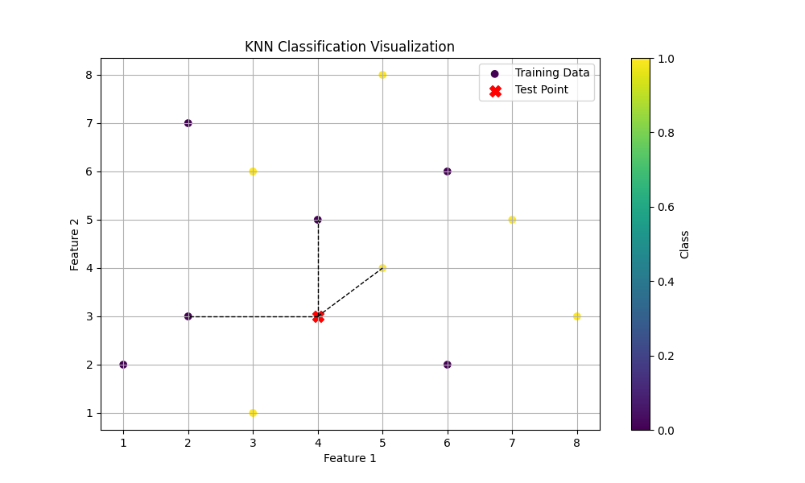

---

# Quantum K-Nearest Neighbors (Quantum-KNN)

This project implements a K-Nearest Neighbors (KNN) classifier enhanced with quantum computing techniques. The core of the project is a hybrid approach that combines classical machine learning with quantum computing, utilizing Grover's Algorithm for efficient nearest neighbor search.




## Project Structure

```
Quantum-KNN/
│
├── quantum_processes/
│   ├── __init__.py
│   ├── encoding.py        # Quantum state preparation and encoding functions
│   ├── distance.py        # Quantum distance calculation functions
│   ├── grover_search.py   # Implementation of Grover's algorithm for nearest neighbor search
│
├── classical_processes/
│   ├── __init__.py
│   ├── knn_logic.py       # KNN classification logic (sorting, voting)
│   ├── data_preprocessing.py  # Data scaling and preparation
│
├── main.py                # Main script to run the quantum KNN classification
├── requirements.txt       # Dependencies and required libraries
└── .gitignore             # Files and directories to ignore in version control
```

## Features

- **Quantum State Preparation**: Classical data is encoded into quantum states for distance measurement.
- **Quantum Distance Calculation**: Uses quantum principles to measure the distance between data points.
- **Grover's Algorithm**: A quantum search algorithm is used to find the nearest neighbor, offering a potential speedup over classical methods.
- **Hybrid KNN Classifier**: Combines quantum-enhanced distance calculation with classical KNN classification logic.

## Requirements

To run this project, you need to install the following dependencies:

```
qiskit
numpy
scikit-learn
matplotlib
```

You can install these using pip:

```bash
pip install -r requirements.txt
```

## Usage

1. **Data Preparation**: The data points are first scaled and preprocessed using classical methods.

2. **Quantum Encoding**: The scaled data points are encoded into quantum states using the functions provided in `quantum_processes/encoding.py`.

3. **Distance Calculation**: Quantum distances between the test point and each data point are calculated using `quantum_processes/distance.py`.

4. **Grover's Search**: Grover's Algorithm is applied to find the nearest neighbor, using `quantum_processes/grover_search.py`.

5. **Classification**: The nearest neighbor is classified using the logic in `classical_processes/knn_logic.py`.

6. **Run the Program**: To execute the program, simply run the `main.py` script:

```bash
python main.py
```

## Example Output

When you run the program, it will output the predicted class for the test point based on the quantum-enhanced KNN classifier. For instance:

```
Nearest neighbor found by Grover's Algorithm: {'01': 516, '10': 508}
Predicted class for test point [4, 3]: 1
```

## How It Works

### Quantum State Preparation
The data points are transformed into quantum states, leveraging qubit rotations (`ry` and `rz` gates) to represent the features of each point.

### Quantum Distance Calculation
Distances between the encoded quantum states are computed using the inner product of their statevectors, providing a quantum measure of similarity.

### Grover's Algorithm
Grover's Algorithm is used to search for the smallest distance, i.e., the closest data point to the test sample. This quantum search provides a quadratic speedup over classical search methods.

### Hybrid KNN
The final classification is performed using classical KNN logic, but with the quantum-calculated distances, blending classical and quantum techniques.

## Running on an IBM Real Quantum Computer

If you want to run the quantum part of this project on a real IBM quantum computer, follow these steps:

1. **Create an IBM Quantum Account**: Sign up for an account at [IBM Quantum Experience](https://quantum-computing.ibm.com/).

2. **Install the IBMQ Provider**: If you haven't already, install the IBMQ provider using:

    ```bash
    pip install qiskit-ibmq-provider
    ```

3. **Save Your IBMQ API Token**: Save your IBMQ API token by running the following command in your Python environment:

    ```python
    from qiskit import IBMQ
    IBMQ.save_account('YOUR_IBM_QUANTUM_API_TOKEN')
    ```

4. **Load the IBMQ Account**: In your `main.py` or `grover_search.py`, load your IBMQ account:

    ```python
    from qiskit import IBMQ

    IBMQ.load_account()
    provider = IBMQ.get_provider(hub='ibm-q')
    ```

5. **Select a Real Quantum Backend**: Replace the simulator backend with a real quantum backend:

    ```python
    backend = provider.get_backend('ibmq_qasm_simulator')
    ```

    You can choose any available backend, such as `ibmq_manila` or `ibmq_quito`. Check the available backends using:

    ```python
    print(provider.backends())
    ```

6. **Run the Quantum Circuit**: Execute the quantum circuit on the selected backend:

    ```python
    job = execute(qc, backend, shots=1024)
    result = job.result()
    counts = result.get_counts()
    ```

7. **Monitor Your Job**: Since running on a real quantum computer can take some time due to queueing, you can monitor the job status:

    ```python
    from qiskit.tools.monitor import job_monitor

    job_monitor(job)
    ```

8. **Review the Results**: After the job completes, review the results and continue with the classification process.

## Limitations and Future Work

- **Scalability**: The current implementation is a proof of concept and might not scale efficiently for large datasets.
- **Quantum Hardware**: The project is designed to run on quantum simulators. Running on actual quantum hardware might introduce challenges such as noise and decoherence.
- **Oracle Construction**: The Grover's Algorithm oracle in this implementation is simplified. Future work could involve constructing a more sophisticated oracle that accurately marks the nearest neighbor state.

## Contributing

Contributions are welcome! If you have suggestions or improvements, feel free to open a pull request or issue.

## License

This project is licensed under the MIT License.

## Acknowledgments

This project was developed as part of an exploration into quantum-enhanced machine learning techniques. Special thanks to the Qiskit community for their resources and support.

---
